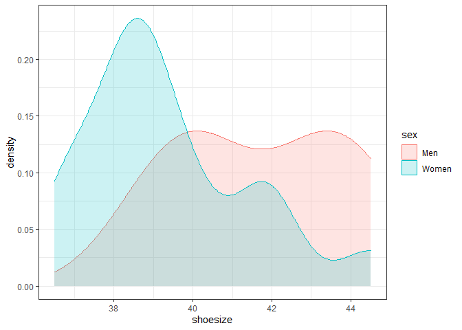

So, what about feet?
================
27 August, 2022

I was curious to find out whether there is a difference in mean shoe
size between men and women, so I did a little study with a convenience
sample of attendees at the Open Science Festival.

This manuscript uses the Workflow for Open Reproducible Code in Science
(Van Lissa et al. 2020) to ensure reproducibility and transparency. All
code <!--and data--> are available at
<https://github.com/cjvanlissa/pac_demo.git>.

<!--The function below inserts a notification if the manuscript is knit using synthetic data. Make sure to insert it after load_data().-->

# Analysis

I performed a one-sided t-test to test the hypothesis that men’s shoe
sizes are greater than women’s, which is sourced here from the file
`analysis.R`:

``` r
library("worcs")
# We recommend that you prepare your raw data for analysis in 'prepare_data.R',
# and end that file with either open_data(yourdata), or closed_data(yourdata).
# Then, uncomment the line below to load the original or synthetic data
# (whichever is available), to allow anyone to reproduce your code:
load_data()

result <- t.test(shoesize ~ sex, dat, alternative = "greater")
```

# Results

There was a significant difference between men’s
()
and women’s men’s
()
shoe sizes,
.

Shoe sizes were distributed as follows:

<!-- -->

# References

<div id="refs" class="references csl-bib-body hanging-indent">

<div id="ref-vanlissaWORCSWorkflowOpen2020" class="csl-entry">

Van Lissa, Caspar J., Andreas M. Brandmaier, Loek Brinkman, Anna-Lena
Lamprecht, Aaron Peikert, Marijn E. Struiksma, and Barbara Vreede. 2020.
“WORCS: A Workflow for Open Reproducible Code in Science,” May.
<https://doi.org/10.17605/OSF.IO/ZCVBS>.

</div>

</div>
