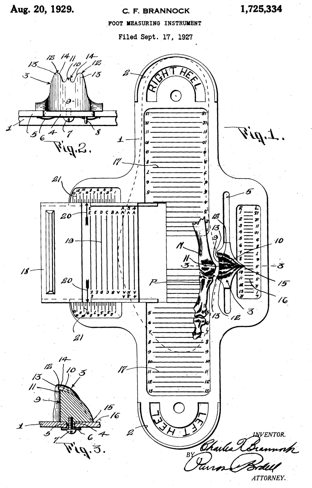

```{r, echo = FALSE}
source("synthetic_data.R")
```


## Data collection
<!-- Have any data been collected for this study already? (Note: "Yes" is not an accepted answer.) -->

**No**, no data have been collected for this study yet.

## Hypothesis
<!-- What's the main question being asked or hypothesis being tested in this study? -->

> We expect that, in a convenience sample of 30 open science enthusiasts, on average, men's feet will be 3 sizes bigger than women's feet. We will test the null-hypothesis that this difference is 0.


## Dependent variable
<!-- Describe the key dependent variable(s) specifying how they will be measured. -->

> Shoe size, as measured on a Brannock device.



## Conditions
<!-- How many and which conditions will participants be assigned to? -->

> This is not an experimental study; we will ask participants to select a biological sex.


## Analyses
<!-- Specify exactly which analyses you will conduct to examine the main question/hypothesis. -->

> To minimize researcher degrees of freedom, we include a "Preregistration-As-Code" [@peikertReproducibleResearchTutorial2021].
We have simulated synthetic data using the code in `synthetic_data.R`.
The intended analyses are been documented in `analysis.R`, and are reproduced here.
Once real data has been collected, the data file will be replaced, and the analyses re-run.

## Outliers and exclusions
<!-- Describe exactly how outliers will be defined and handled, and your precise rule(s) for excluding observations. -->

> We will remove shoe sizes outside the interval $[36, 49]$.

## Sample size
<!-- How many observations will be collected or what will determine sample size? No need to justify decision, but be precise about _exactly_ how the number will be determined. -->

> We will use a convenience sample of attendees of the Open Science Festival. We expect about 30 participants. Assuming an average shoe size difference of 3 and SD of 1.5, we can estimate power to reject the null hypothesis:

```{r}
power_analysis <- replicate(1000, {
  dat <- generate_data()
  result <- t.test(shoesize ~ sex, dat)
  result$p.value < .05
})
sum(power_analysis)/1000
```

## Study type
Finally. For record keeping purposes, please tell us the type of study you are pre-registering.

* Observational/archival study

# References
## 
\vspace{-2pc}
\setlength{\parindent}{-0.5in}
\setlength{\leftskip}{-1in}
\setlength{\parskip}{8pt}
\noindent
